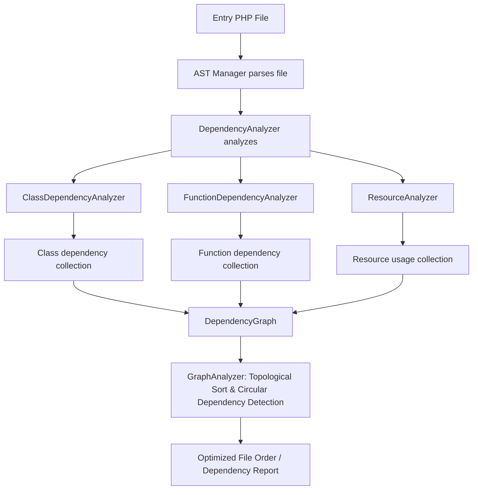

# Workflow Diagram

```mermaid
graph TD
    A[Entry PHP File] --> B[AST Manager parses file]
    B --> C[DependencyAnalyzer analyzes]
    C --> D1[ClassDependencyAnalyzer]
    C --> D2[FunctionDependencyAnalyzer]
    C --> D3[ResourceAnalyzer]
    D1 --> E1[Class dependency collection]
    D2 --> E2[Function dependency collection]
    D3 --> E3[Resource usage collection]
    E1 --> F[DependencyGraph]
    E2 --> F
    E3 --> F
    F --> G[GraphAnalyzer: Topological Sort & Circular Dependency Detection]
    G --> H[Optimized File Order / Dependency Report]
```

> This diagram shows the main workflow for analyzing dependencies and resources in a PHP project using this package.
